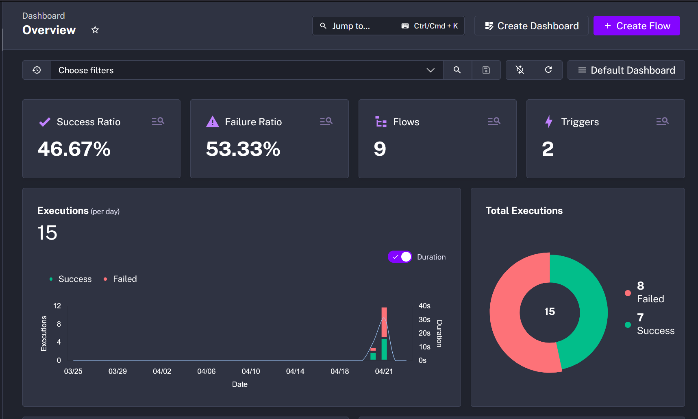
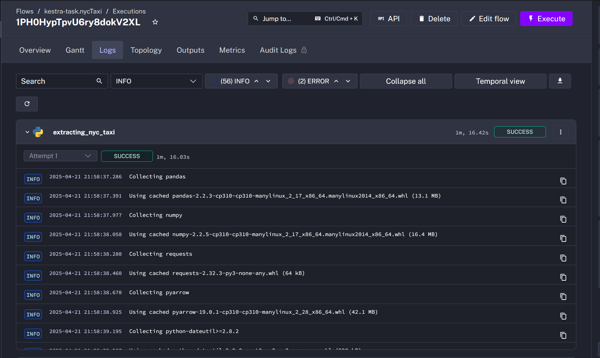
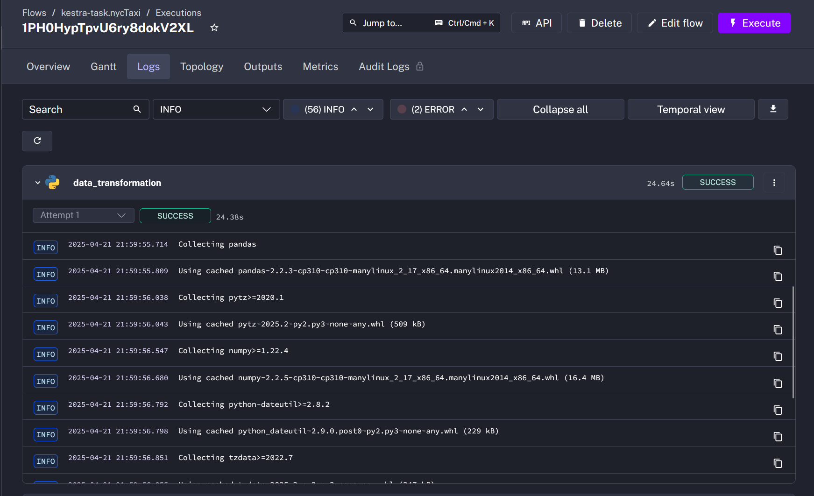
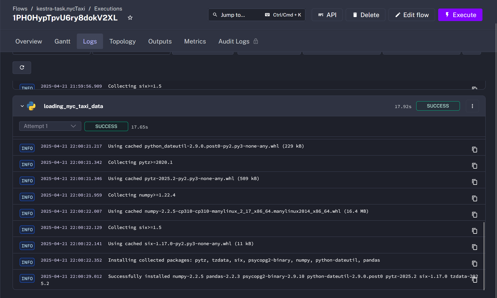
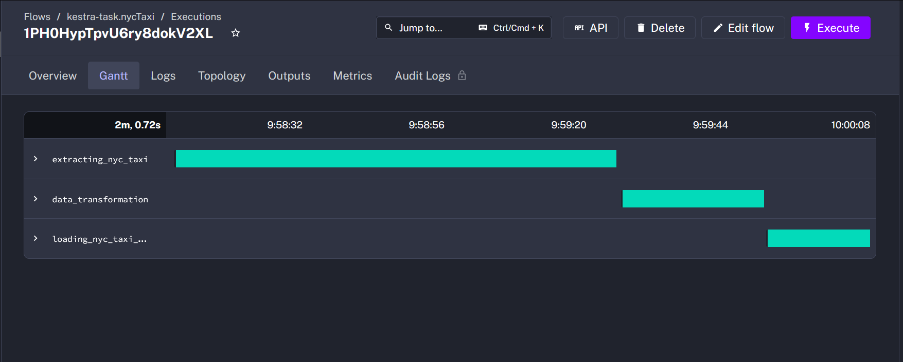
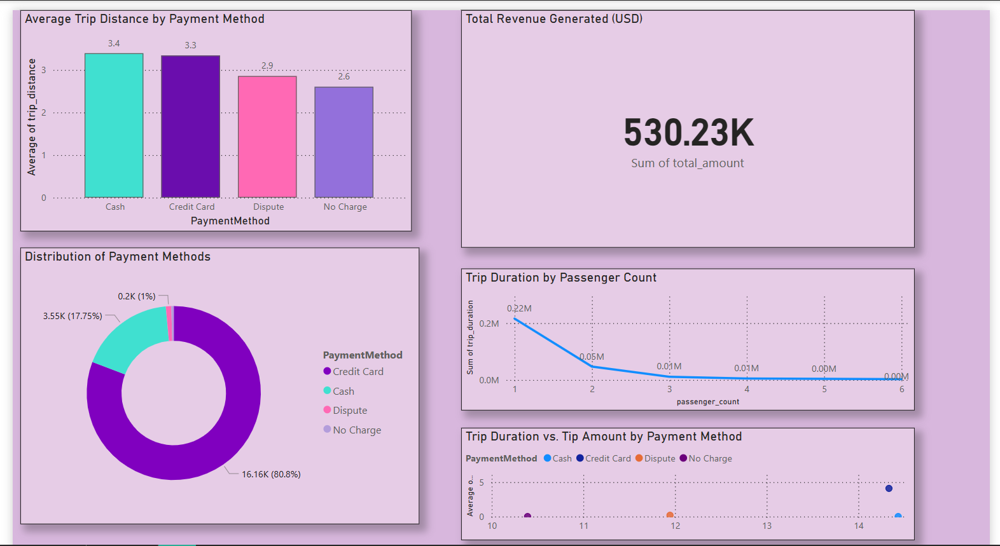

## ETL Pipeline and Dashboard Walkthrough using Screenshots

This file tells the story of how Kestra extracts the data from Kaggle using an API all the way to how it was visualized on PowerBI

---------------------------------------------------------------------------------------------------------
### Kestra Orchestration
This step shows kestras dashboard after all the three processes.

### Step 1: Data Extraction
Data extraction on Kestra enabled by Kaggle API to download the NYC Yellow Taxi trip data for January 2023.

### Step 2: Data Transformation
This step removes ghost trips, those with zero trip distance and or no passengers, introduces a new column trip duration and normalizes timestamps.

### Step 3: Data Loading
Kestra loads the output of the previous step which is a filtered csv file onto a dockerized PostreSQL environment.

### Step 4: Success in Kestra Orchestration
Kestra displays a visual of all three tasks successfully executed.

---------------------------------------------------------------------------------------------------------

---------------------------------------------------------------------------------------------------------
<!-- ### PostgreSQL instance on Docker
A containerized instance of PostgreSQL on Docker Engine
-->
---------------------------------------------------------------------------------------------------------

---------------------------------------------------------------------------------------------------------
### PowerBI Visualization
The Star-Schema is created as a visualization of the metrics to provide insights with ease.

---------------------------------------------------------------------------------------------------------
